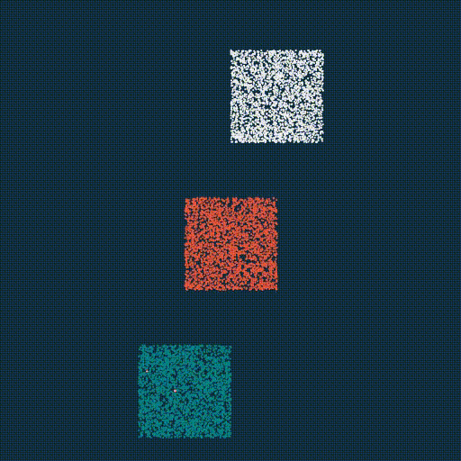

# 一起成为 Taichi contributors 第 1 期活动中文指南

## 本期主题：在 Taichi 的 CI/CD 中添加对示例程序的测试

对很多小伙伴来说，Taichi 的[示例程序](https://github.com/taichi-dev/taichi/tree/master/python/taichi/examples)是学习 Taichi 的极佳资源。然而，由于 Taichi 目前仍处在快速迭代的状态，偶尔会出现由于使用的语法或 API 行为发生变化导致示例程序不可用的情况，这会给学习 Taichi 的小伙伴带来困扰。为了尽可能避免这种情况的发生，我们希望能在 Taichi 的 CI/CD 中添加对这些示例程序的测试（[Issue #3580](https://github.com/taichi-dev/taichi/issues/3580)）。

Taichi 的示例程序主要分为以下两类：
- API 用法的简单示例，通常会输出一些确定的计算结果；
- 具体的渲染或仿真的例子，通常依赖 GUI 来进行可视化，没有确定的计算结果。

接下来，我们将用两个具体的例子向大家介绍如何添加对这两类示例程序的测试。

## 为示例程序 [laplace](https://github.com/taichi-dev/taichi/blob/master/python/taichi/examples/algorithm/laplace.py)（有确定计算结果的例子）添加测试

（可参考 PR [#3721](https://github.com/taichi-dev/taichi/pull/3721)）

1. 将示例程序的具体执行部分包在 `main()` 函数内，使得前面的声明部分可以被单独 import：

```python
for i in range(10):
    x[i, i + 1] = 1.0

laplace()

for i in range(10):
    print(y[i, i + 1])
```
-->
```python
def main():
    for i in range(10):
        x[i, i + 1] = 1.0

    laplace()

    for i in range(10):
        print(y[i, i + 1])


if __name__ == '__main__':
    main()
```

2. 创建测试文件 `tests/python/examples/algorithm/test_laplace.py`，添加对应该示例程序的测试用例。由于该测试用例有确定的计算结果，我们可以直接进行正确性检验：

```python
# 命名为 test_xxx 是为了被 pytest 识别为一个测试用例
def test_laplace(): 
    # import 原 example 的声明部分，此处必须在测试用例内部 import 因为其中涉及具体的执行逻辑
    from taichi.examples.algorithm.laplace import laplace, x, y

    # 沿用原 example 中的初始化部分
    for i in range(10):
        x[i, i + 1] = 1.0

    # 沿用原 example 中的计算部分
    laplace()

    # 将原 example 中输出结果的部分改为正确性检验
    for i in range(10):
        assert y[i, i + 1] == (4.0 if i % 3 == 1 else 0.0)
```

## 为示例程序 [mpm99](https://github.com/taichi-dev/taichi/blob/master/python/taichi/examples/simulation/mpm99.py)（依赖 GUI 进行可视化的例子）添加测试

（可参考 PR [#3995](https://github.com/taichi-dev/taichi/pull/3995)）

1. 将示例程序的具体执行部分包在 `main()` 函数内，使得前面的声明部分可以被单独 import（同上一个示例）。

2. 创建测试文件 `tests/python/examples/simulation/test_mpm99.py`，添加对应该示例程序的测试用例。由于该示例程序依赖 GUI 进行可视化，无法自行终止，我们在测试时将 GUI 部分去除，仅进行一定帧数的计算确保其能正常执行（不出现编译 / 运行时错误）：

```python
# 希望测试执行的帧数
FRAMES = 100


def test_mpm99():
    from taichi.examples.simulation.mpm99 import dt, initialize, substep

    # 沿用原 example 中的初始化部分
    initialize()

    # 去除对 GUI 的使用，仅执行 FRAMES 帧
    for i in range(FRAMES):
        for s in range(int(2e-3 // dt)):
            substep()
```

3. 为了保证该示例程序结果的正确性，我们还希望将上面写的测试文件变成一个可以生成视频的脚本，方便发布 Taichi 新版本的小伙伴在发布前一键生成所有视频进行视觉上的确认：

```python
def video_mpm99(result_dir):
    from taichi.examples.simulation.mpm99 import (dt, initialize, material,
                                                  substep, x)

    # ti.VideoManager 用于生成视频
    video_manager = ti.VideoManager(output_dir=result_dir,
                                    framerate=24,
                                    automatic_build=False)
    # 基本沿用原 example 的执行流程（差别部分均有注释）
    initialize()
    gui = ti.GUI("Taichi MLS-MPM-99",
                 res=512,
                 background_color=0x112F41,
                 show_gui=False)  # 不打开窗口显示
    for i in range(FRAMES):  # 执行固定的帧数而非等待键盘输入
        for s in range(int(2e-3 // dt)):
            substep()
        gui.circles(x.to_numpy(),
                    radius=1.5,
                    palette=[0x068587, 0xED553B, 0xEEEEF0],
                    palette_indices=material)
        # 不再 gui.show() 而是往 video manager 里写入一帧
        video_manager.write_frame(gui.get_image())
        gui.clear()
    # 最终生成视频
    video_manager.make_video(mp4=True, gif=False)


if __name__ == '__main__':
    # 使用统一的命令行参数处理方式，便于一键生成所有视频
    parser = argparse.ArgumentParser(description='Generate mpm99 video')
    parser.add_argument('output_directory',
                        help='output directory of generated video')
    video_mpm99(parser.parse_args().output_directory)
```

## 在本地检查自己添加的测试是否能正常工作（以 mpm99 为例）

1. 确保原 example 仍然能正常运行，即执行 `ti example mpm99` 结果和原来保持一致。

2. 对于为 pytest 增加的测试用例，可以通过 `python tests/run_tests.py -k "test_mpm99"` 来执行测试。

3. 对于视频生成脚本，可以通过 `python tests/python/examples/simulation/test_mpm99.py output_mpm99` 执行并在 `output_mpm99` 目录下查看生成的视频：



## 附录

[Taichi 贡献者指南](https://docs.taichi.graphics/docs/contribution/contributor_guide)
