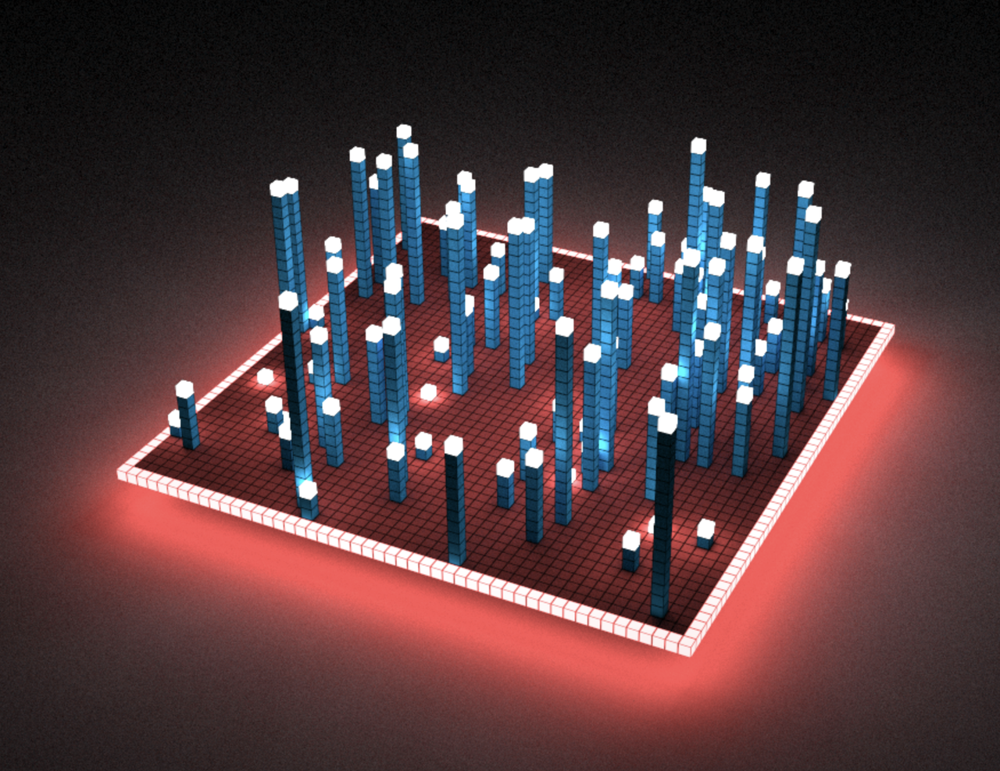
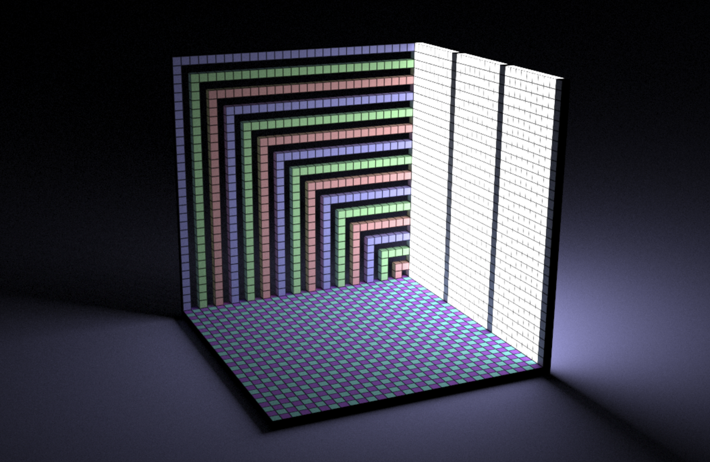
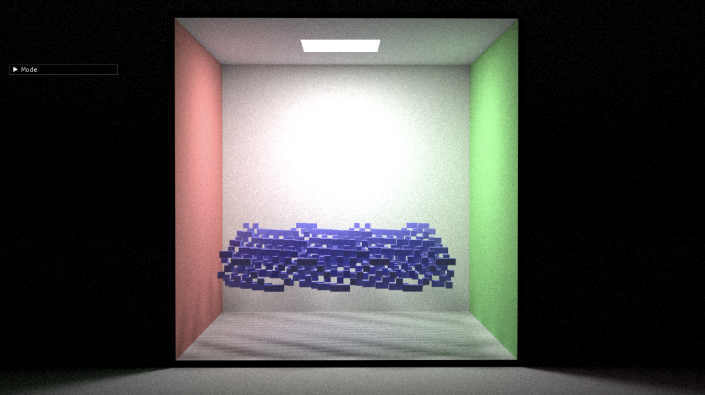

# Voxel Challenge 参考资料

## **目录**

- [配置代码库](#配置代码库)
  - [安装 Taichi](#安装-Taichi)
- [配置 voxel editor](#配置-voxel-editor)
- [快速入门 Taichi](#快速入门-Taichi)
  - [什么是 @ti.kernel @ti.func](#什么是-@ti.kernel-@ti.func)
- [多层 for 循环技巧](#多层-for-循环技巧)
- [使用随机数](#使用随机数)
- [Taichi math 模块介绍](#Taichi-math-模块介绍)
  - [GLSL 风格的向量操作](#GLSL-风格的向量操作)
- [GLSL 风格的函数](#GLSL-风格的函数)
- [案例代码](#案例代码)
- [博客投稿](#博客投稿)

## 配置代码库

#### 安装 Taichi

**首先确保你的 pip 已经是最新版本，否则可能会报 GGUI 找不到的错误：**

```Bash
pip3 install pip --upgrade
```

如果第一次安装 Taichi 请确保在 Python 3.6/3.7/3.8/3.9/3.10 （64-bit）环境下输入这个命令：

```Bash
pip3 install -r requirements.txt
```

如有其他问题，可先至 [文档](https://docs.taichi.graphics/) 搜索，或在 [slack channel](https://join.slack.com/t/taichicommunity/shared_invite/zt-14ic8j6no-Fd~wKNpfskXLfqDr58Tddg) #voxel-challenge 中提问。

#### 配置 voxel editor 

打开 https://github.com/taichi-dev/voxel-challenge/

1. 在 repo 页面中，点击 `use this template` 按钮。


2. 在打开的页面中，选择 owner 为你自己，并填写项目名称。
3. Repo 权限需选择 Public。

</img>

4. Download ZIP 将示例代码下载到本地。

5. 在自己的本地终端/ VS code 运行示例，感受 voxel editor 的效果，例如运行 example1.py 文件。

```
 python3 example1.py
```

- 随后可以打开 py 文件，开始修改代码 DIY 自己的作品。

</img>

- 备注：请记得将 Taichi 升级到 v1.0 版本，才可顺利使用 voxel renderr。

升级命令为

```
python3 -m pip install --upgrade taichi
```

- 再次强调：每个参赛者拥有 **128x128x128** 的网格。**每个网格大小是 1/64**，也就是说整个网格的 x, y, z 坐标范围是 [-1, 1]。注意网格的下标的**每个维度从 -64 开始，一直到 63 结束**。下标可以是负数。

## 快速入门 Taichi

Taichi 和 Python 语法基本一致，你需要注意的是在 Taichi scope 中变量是有类型的，你不可以随意地将一个变量重新赋值为一个不同类型的变量，比如：

```Python
v = ti.Vector([0, 0, 0])
v = 1.0
```

是不行的。Taichi scope 是指被 @ti.kernel 和 @ti.func 修饰的函数，这种函数是被 Taichi 接管和编译执行的。下面是简要介绍。

### 什么是 @ti.kernel @ti.func

被 `ti.kernel` 修饰的函数叫做 kernel 函数。kernel 函数是 Taichi 编译和运行的入口，一个程序里面可以有多个 kernel 函数，kernel 之间互相不能调用。

被 `ti.func` 修饰的函数叫做 func 函数。func 函数只能被其它 func 函数或者 kernel 调用。

在 kernel 函数中，顶层的 for 循环会被自动并行执行，非顶层的 for 循环则会被串行执行。

```Python
@ti.kernel
def example():
    for i in range(100):  # top level and executed in parallel
        for j in range(100):  # not top level, serialized
  
    for k in range(100):  # another top level for loop and executed in parallel
        pass
```

如果你不想让 taichi 并行执行某个顶层 的 for 循环，可以用 `ti.loop_config` 把它关掉：

```Python
@ti.kernel
def example():
    ti.loop_config(serialize=True)
    for i in range(100):  # top level but serialized
```

### 多层 for 循环技巧

在多层嵌套的 for 循环中，只有顶层的 for 循环是并行执行的。如果你希望它们全部是并行执行的也是可以的。Taichi 提供了类似标准库 `itertools.product` 的函数 `ti.ndrange`，可以让你同时遍历多个 range:

```Python
ti.ndrange(arg1, arg2, arg3, ...)
```

这其中，每一个 `arg` 都是一个整数，这时它相当于一个区间 `range(n)`, 或者一对整数 `(a, b)`，这时它相当于区间 `range(a, b)`。`ti.ndrange` 会将所有这些区间组合成一个多维乘积：

```Python
for i, j, k in ti.ndrange(3, (1, 3), 5):
    print(i, j, k)  # 遍历 i 从 0 到 2，j 从 1 到 2， k 从 0 到 4 的所有组合
```

### 使用随机数

`ti.random()` 会返回一个 `[0,1)` 区间中的浮点数，如果你想返回一个区间 `[a, b)` 内的随机数，可以用

```Python
x = ti.random() * (b - a) + a
```

如果你想返回一个 `n <= x < m` 的整数 `x`，可以用

```Python
x = int(ti.random() * (m - n)) + n
```

## Taichi `math` 模块介绍

Taichi 的 math 模块的引用方式为

```Python
import taichi.math as tm
```

或者

```Python
from taichi.math import *
```

目前 math 模块提供以下功能支持：

### GLSL 风格的向量操作

数学模块提供了 `vec2`, `vec3`, `vec4` 三种浮点类型向量， `ivec2`, `ivec3`, `ivec4` 三种整数类型向量，以及 `mat2`, `mat3`, `mat4` 三种浮点矩阵。

你可以使用多种不同的方式声明一个向量，可以是一个数字，或者是数字/列表/向量/swizzle 的组合，在后者的情形只要它们的长度加起来等于向量类型的长度即可：

```Apache
v = vec3(1, 2, 3)
v = vec3([1, 2, 3])
v = vec3([1, 2], 3)
v = vec3(v.xy, 1)
v = v.xxz
```

在访问向量分量时，你可以使用 `xyzw`, `rgba`, `stpq` 这几种方式，以及它们不同顺序的组合：其中 `x/y/z/w` 分别表示向量的第 1、2、3、4 个分量。`rgba` 和 `stpq` 同理。

```Python
v.yxz += w  # v 的 (1, 0, 2) 分量分别加上 w 的 (0, 1, 2) 分量
v.xx += 1   # v 的 0 分量两次加上 1
```

### GLSL 风格的函数

你可以使用如 `smoothstep`, `clamp`, `mix`, `step` 等常用的 glsl 函数。这些函数在构造几何形状时非常有用。这些函数同时接受向量和标量作为参数:

```Python
x = 1.0
x = smoothstep(0.0, 1.0, x)
y = vec3(1, 2, 3)
y = smoothstep(0.2, 0.8, y)
```

### 复数运算的支持

此功能目前不在 v1.0.0 的 release 版本中，会在下一次 release 时发布，所以需要更新到最新版本。主要提供了对 `vec2` 类型的复数运算的支持。

```Python
z = vec2(1, 1)  # 1 + 1j
w = vec2(-1, 1)  # -1 + 1j
x = cmul(z, w)  # complex multiplicaiton z * w
x = cdiv(z, w)  # complex division z / w
x = cpow(w, 3)  # complex power w^3
x = clog(w)  # logarithm of w
x = cconj(w)  # conjugate of w
```

## 案例代码

### Example 1

```Python
from scene import Scene
import taichi as ti
from taichi.math import *

scene = Scene(exposure=10)
scene.set_floor(-0.05, (1.0, 1.0, 1.0))
scene.set_background_color((1.0, 0, 0))


@ti.kernel
def initialize_voxels():
    n = 50
    for i, j in ti.ndrange(n, n):
        if min(i, j) == 0 or max(i, j) == n - 1:
            scene.set_voxel(vec3(i, 0, j), 2, vec3(0.9, 0.1, 0.1))
        else:
            scene.set_voxel(vec3(i, 0, j), 1, vec3(0.9, 0.1, 0.1))

            if ti.random() < 0.04:
                height = int(ti.random() * 20)

                for k in range(1, height):
                    scene.set_voxel(vec3(i, k, j), 1, vec3(0.0, 0.5, 0.9))
                if height:
                    scene.set_voxel(vec3(i, height, j), 2, vec3(1, 1, 1))


initialize_voxels()

scene.finish()
```

</img>

 Example 1 的效果图（如上图）

### Example 2

```Python
from scene import Scene
import taichi as ti
from taichi.math import *

scene = Scene()
scene.set_floor(0, (0.5, 0.5, 1))


@ti.kernel
def initialize_voxels():
    for i in range(31):
        for j in range(31):
            is_light = int(j % 10 != 0)
            scene.set_voxel(vec3(j, i, -30), is_light + 1, vec3(1, 1, 1))
            color = max(i, j)
            if color % 2 == 0:
                scene.set_voxel(
                    vec3(0, i, j - 30), 1,
                    vec3((color % 3 // 2) * 0.5 + 0.5,
                         ((color + 1) % 3 // 2) * 0.5 + 0.5,
                         ((color + 2) % 3 // 2) * 0.5 + 0.5))

    for i in range(31):
        for j in range(31):
            c = (i + j) % 2
            index = vec3(i, 0, j - 30)
            scene.set_voxel(index, 1,
                            vec3(c * 0.3 + 0.3, (1 - c) * 0.8 + 0.2, 1))


initialize_voxels()

scene.finish()
```

</img>

 Example 2 的效果图（如上图）

### Example 3

```Python
from scene import Scene
import taichi as ti
from taichi.math import *

scene = Scene(voxel_edges=0, exposure=30)

scene.set_floor(0, (1.0, 1.0, 1.0))

n = 50


@ti.kernel
def initialize_voxels():
    for i in range(n):
        for j in range(n):
            scene.set_voxel(vec3(0, i, j), 1, vec3(0.9, 0.3, 0.3))
            scene.set_voxel(vec3(n, i, j), 1, vec3(0.3, 0.9, 0.3))
            scene.set_voxel(vec3(i, n, j), 1, vec3(1, 1, 1))
            scene.set_voxel(vec3(i, 0, j), 1, vec3(1, 1, 1))
            scene.set_voxel(vec3(i, j, 0), 1, vec3(1, 1, 1))

    for i in range(-n // 8, n // 8):
        for j in range(-n // 8, n // 8):
            scene.set_voxel(vec3(i + n // 2, n, j + n // 2), 2, vec3(1, 1, 1))

    for i_ in range(n // 8 * 3):
        i = i_ * 2
        for j in range(n // 4 * 3):
            scene.set_voxel(
                vec3(j + n // 8, n // 4 + ti.sin(
                    (i + j) / n * 30) * 0.05 * n + i / 10, -i + n // 8 * 7), 1,
                vec3(0.3, 0.3, 0.9))


initialize_voxels()
scene.finish()
```

</img>

 Example 3 的效果图（如上图）
 
 ### Example 4
 
 ```Python
 from scene import Scene
import taichi as ti
from taichi.math import *

scene = Scene(voxel_edges=0, exposure=2)
scene.set_floor(-0.85, (1.0, 1.0, 1.0))
scene.set_background_color((0.5, 0.5, 0.4))
scene.set_directional_light((1, 1, -1), 0.2, (1, 0.8, 0.6))


@ti.func
def create_block(pos, size, color, color_noise):
    for I in ti.grouped(
            ti.ndrange((pos[0], pos[0] + size[0]), (pos[1], pos[1] + size[1]),
                       (pos[2], pos[2] + size[2]))):
        scene.set_voxel(I, 1, color + color_noise * ti.random())


@ti.func
def create_leaves(pos, radius, color):
    for I in ti.grouped(
            ti.ndrange((-radius, radius), (-radius, radius),
                       (-radius, +radius))):
        f = I / radius
        h = 0.5 - max(f[1], -0.5) * 0.5
        d = vec2(f[0], f[2]).norm()
        prob = max(0, 1 - d)**2 * h  # xz mask
        prob *= h  # y mask
        # noise
        prob += ti.sin(f[0] * 5 + pos[0]) * 0.02
        prob += ti.sin(f[1] * 9 + pos[1]) * 0.01
        prob += ti.sin(f[2] * 10 + pos[2]) * 0.03
        if prob < 0.1:
            prob = 0.0
        if ti.random() < prob:
            scene.set_voxel(pos + I, 1, color + (ti.random() - 0.5) * 0.2)


@ti.func
def create_tree(pos, height, radius, color):
    create_block(pos, ivec3(3, height - radius * 0.5, 3), vec3(0.7), vec3(0.3))

    # Leaves
    create_leaves(pos + ivec3(0, height, 0), radius, color)

    # Ground
    for i, j in ti.ndrange((-radius, radius), (-radius, radius)):
        prob = max((radius - vec2(i, j).norm()) / radius, 0)
        prob = prob * prob
        if ti.random() < prob * prob:
            scene.set_voxel(pos + ivec3(i, 1, j), 1,
                            color + ti.random() * vec3(0.1))


@ti.func
def make_fence(start, direction, length):
    color = vec3(0.5, 0.3, 0.2)
    create_block(start, direction * length + ivec3(3, 2, 3), color, vec3(0.1))

    fence_dist = 3
    for i in range(length // fence_dist + 1):
        create_block(start + direction * i * fence_dist + ivec3(1, -3, 1),
                     ivec3(1, 5, 1), color, vec3(0))


@ti.kernel
def initialize_voxels():
    for i in range(4):
        create_block(ivec3(-60, -(i + 1)**2 - 40, -60),
                     ivec3(120, 2 * i + 1, 120),
                     vec3(0.5 - i * 0.1) * vec3(1.0, 0.8, 0.6),
                     vec3(0.05 * (3 - i)))

    create_block(ivec3(-60, -40, -60), ivec3(120, 1, 120), vec3(0.3, 0.2, 0.1),
                 vec3(0.01))

    create_tree(ivec3(-20, -40, 25), 65, 35, vec3(1.0, 0.3, 0.15))
    create_tree(ivec3(45, -40, -45), 15, 10, vec3(0.8, 0.4, 0.1))
    create_tree(ivec3(20, -40, 0), 45, 25, vec3(1.0, 0.4, 0.1))
    create_tree(ivec3(30, -40, -20), 25, 15, vec3(1.0, 0.4, 0.1))
    create_tree(ivec3(30, -40, 30), 45, 25, vec3(1.0, 0.4, 0.1))

    make_fence(ivec3(-58, -36, -58), ivec3(1, 0, 0), 115)
    make_fence(ivec3(-59, -36, 57), ivec3(1, 0, 0), 115)
    make_fence(ivec3(-59, -36, -58), ivec3(0, 0, 1), 115)
    make_fence(ivec3(57, -36, -58), ivec3(0, 0, 1), 115)


initialize_voxels()

scene.finish()
```

</img>

Example 4 的效果图（如上图）

🥚 彩蛋：感谢社区小伙伴 Moses 逐行讲解代码，想知道秋叶是怎么做出来的？请参考 [讲解视频](https://www.bilibili.com/video/BV1dv4y1N7ni/)

## 博客投稿

欢迎大家将使用 Taichi 的过程写成博客分享给社区。投稿分享还可以获得 Taichi 周边水杯。优秀的博客也将有机会在太极官方账号进行传播~

投稿需大致包含作品信息和创作过程，可以参考这篇内容：

[The Girl with a Voxel Earring 幕后](https://mp.weixin.qq.com/s/KzlrWKhli5OwQvw5NrzLoQ)

### 模板参考

#### 作品信息

作品信息可以包括源代码链接、创意的来源、作品的截图等。其他内容可根据个人风格创作。

#### 创作过程

- 分步骤来说明作品的实现过程，并放一些代码的截图。
- 用 Taichi 实现作品的过程中，有用到哪些公式，它们如何塑造出作品的哪个部分。
- 如何生成 Taichi 代码，为什么这样实现。
- 如何进行效果处理（如渲染、光线追踪等）。

ps：如果有条件的话，也可以将创作的过程录屏变成 GIF 让大家能更直观感受到。

#### 结论&思考

- 后续这份作品可以继续优化或升级的地方。
- 使用 Taichi 的一些感想。
- 建议 Taichi 再做哪些功能上的调整。
