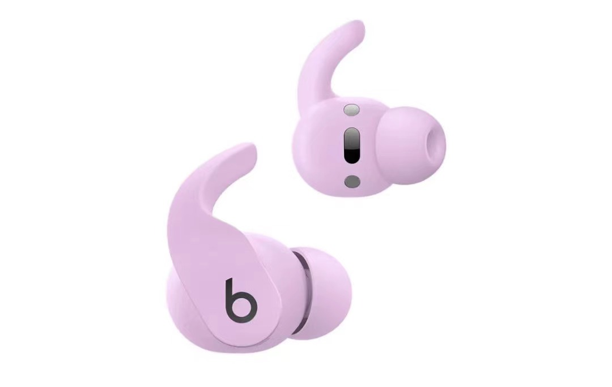
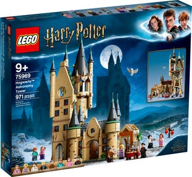
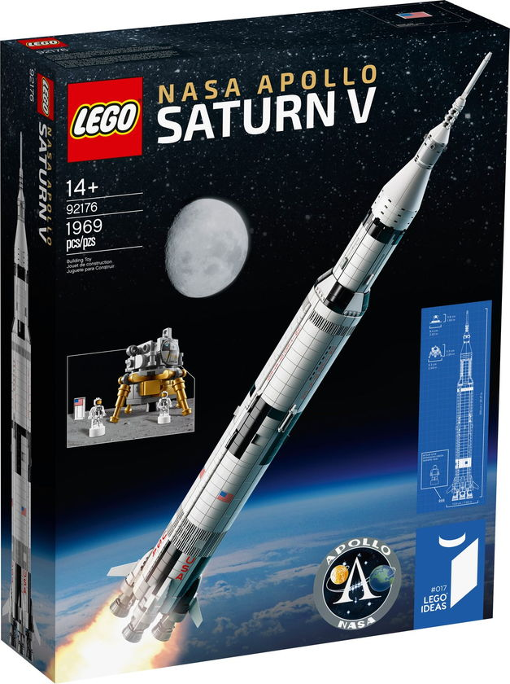
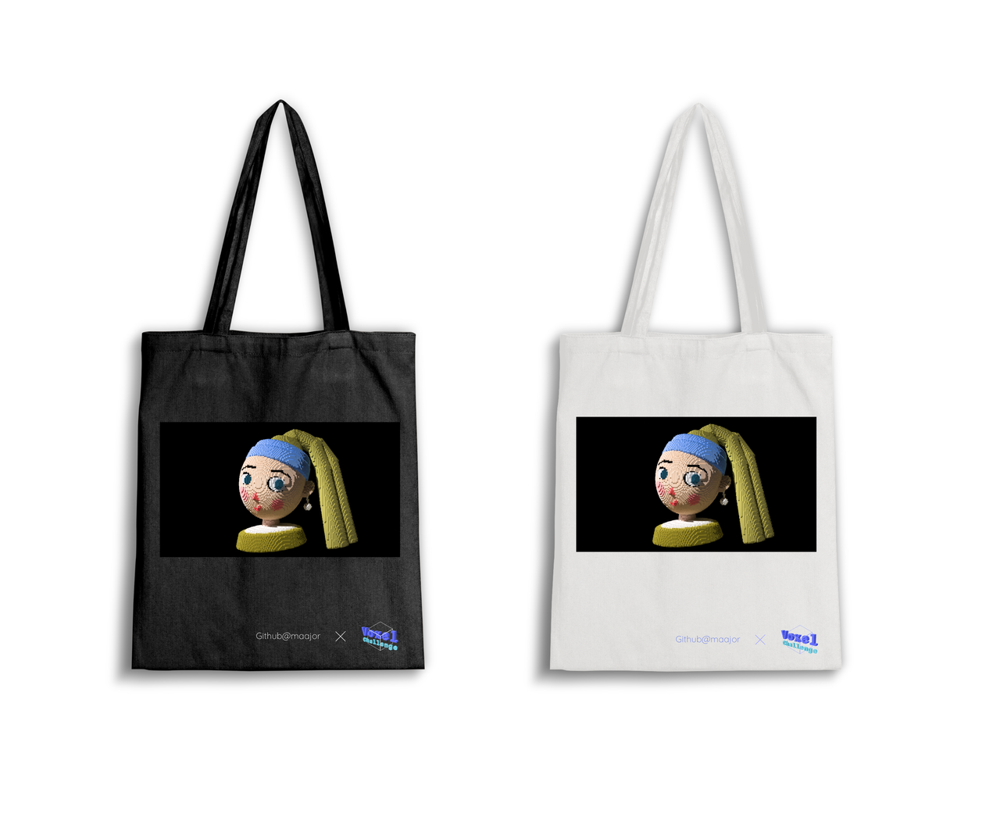
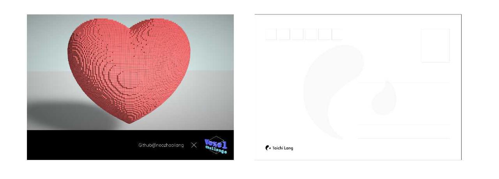
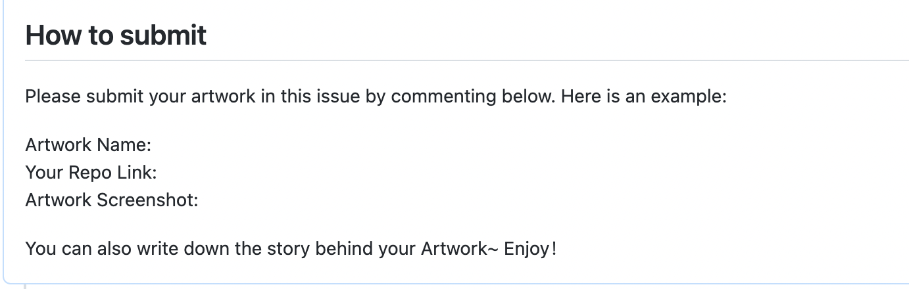

# Taichi Voxel Challenge 2022

# 大赛介绍

Taichi Voxel Challenge 2022（体素创意大赛）由 Taichi Lang 社区主办，参赛选手需要遵守比赛规则，使用 Voxel renderer 在 99 行代码之内发挥创意完成作品。

这是太极社区第一次举办体素创意大赛，本届大赛主题不限。参赛作品可以是天马行空地想象，也可以是贴近生活的创作。欢迎打开脑洞卷创意！参赛者可以任意设置每个网格的颜色和材料（体素或光源），创造自己的 3D 小世界！

具体 [参赛规则](#参赛指南) 和 [作品提交方式](#作品提交) 见后文。

# 大赛时间线

- 比赛公布：4 月 29 日 20:00（UTC+8）
- 作品截止提交：5 月 18 日 17:00（UTC+8）
- 投票时间：5 月 19 日 10:00 - 5 月 24 日下午 17:00（UTC+8）
- 公布结果：5 月 25 日

# 比赛奖项

🏆 本次大赛设置了一二三等奖和设计师奖。其中一二三等将由社区投票选出。设计师奖将由大赛组委会选出。

- 一等奖：任天堂 Switch 日版

</img>

- 二等奖：Beats Fit Pro 降噪耳机

</img>

- 三等奖 X 2：乐高玩具

</img> </img> 

- 设计师奖：大赛组委会将根据投稿，选出适合做成周边的 5 个作品。每位获奖选手将收获一件印有自己作品图案的定制帆布包。

  </img>

⭐️ 所有参赛者投稿成功即可获得 Voxel Challenge 周边礼包！礼包内容为 Voxel Challenge 定制 T-shirt 和口罩。

</img></img>

**特别福利：**

- 投稿人大赛期间在社交媒体平台（朋友圈、推特等）发布带 #voxelchallenge tag 的推文，并@TaichiGraphics 截图发给@开发者小助手，即可额外获得自己作品定制的明信片。
- 赛中或赛后发布作品相关文章即可获得 Taichi 水杯一个。

</img></img>

# 参赛指南

## 作品提交

- 建议提交作品的小伙伴先加入 [Slack Channel](#slack) 或 [微信群](#微信群) 及时获取大赛相关信息～
- 记得将 Taichi 升级到 v1.0 版本，才可顺利使用 voxel renderer 哦

- 提交内容：
  - 包含作品名称 + repo 链接 + 作品效果截图。
  - 作品 repo：使用 "use this template"从给定的 [Template repo](https://github.com/taichi-dev/voxel-challenge/) 中复制出自己的新 repo 并公开 ，在此基础上形成作品 repo，需要包含源代码 main.py 文件、README.md 文件。
  - 作品代码：请将自己的作品代码，填充到作品 repo 的 main.py 文件。
  - 作品效果截图：作品截图请放在 README.md 的 Demo 标题下，图片格式尺寸统一为 1280 x 720
- 提交位置：请在指定 [issue](https://github.com/taichi-dev/voxel-challenge/issues/11) 中，留言作品仓库  Repo 链接 + 作品截图，如图所示。

  </img>

**注：如投稿人提交多个作品，请分开留言。**

- Template Repo 链接：https://github.com/taichi-dev/voxel-challenge/
- 作品提交 Issue 链接：https://github.com/taichi-dev/voxel-challenge/issues/11

## 参赛规则

- 每个参赛者拥有 128x128x128 的网格。每个网格大小是 1/64。
  - 也就是说整个网格的 x, y, z 坐标范围是 [-1, 1]。
  - 注意网格的下标的每个维度从 -64 开始，一直到 63 结束。
- 只能修改 main.py，总代码不超过 99 行，每一行宽度不能超过 120 个字符。
- 除了 **scene、taichi、taichi.math** 以外不能 import 别的包，不能使用文件 IO，也不能创建新的 field。
- 可以移动相机以后按 P 键来截图，截图位于 `screenshots` 目录下。
- 提交作品需要是截图原图，不能使用 Photoshop 等图片处理工具。
- 本比赛只能使用以下 5 个 API：

```Python
scene = Scene(voxel_edges=0.06, exposure=3)
# voxel_edges: 每个像素描边的宽度，可以为 0；
# exposure: 曝光值，防止画面过暗或者过亮

scene.set_voxel(idx, mat, color)
# 其中 mat（材料） 有两种选择:
# 0 代表体素不存在（可用于删除）
# 1 代表实心体素
# 2 代表光源
# 
# color 是一个范围在 0~1 的 3D 向量，如 vec3(0.2, 0.3, 0.9)
mat, color = scene.get_voxel(idx)

# 获取体素 idx 的材质和颜色

scene.set_floor(height=0, color=(r, g, b))
# 设置地板的高度和颜色

Scene.set_directional_light(direction, direction_noise, color)
# 加入一个方向光源, 见 example4.py
# 注意 direction 是迎向光源的方向

scene.set_background_color(color)
# 设置天空颜色
```

`color` 参数中的 r, g, b 均为 0.0 到 1.0 之间的实数，存储时会转换成 uint8 格式 (0~255)。

为了方便参赛者，三维坐标 `idx` 的输入可以是浮点数。比如，`(3.5, 10.9, 20.2)` 会被四舍五入到 `(4, 11, 20)`。`idx` 的有效范围区间是 `[-64, 64)`x `[-64, 64)` x `[-64, 64)`。超出此范围会导致未定义的行为。

坐标轴如下:


- 参赛作品必须符合社区行为规范 [COC](https://github.com/taichi-dev/taichi/blob/master/CODE_OF_CONDUCT.md)。不得包含政治、血腥暴力、成人内容、仇恨言论等违反适用法律、法规、政策、社会道德准则的内容。组委会有权拒绝其所认定可能存在前述情形的作品参赛。

- 参赛作品必须公开源代码且为作者原创，无知识产权争议。若参赛作品涉嫌抄袭或侵犯他人知识产权的情形，一律取消评奖资格，并由侵权方承担全部相关责任。

- 投稿参与本次比赛即代表作者在全世界范围内无偿、不可撤销地授权大赛主办方在主办方指定的境内外媒体平台使用投稿人的作品为 Voxel Challenge 宣传。主办方发表的内容将注明投稿人信息。

- 主办方保留对本次比赛的全部解释权。

## 大赛评选

### 投票时间

一二三等奖作品投票将在投稿截止后开始。投票时间为 5 月 19 日 10:00 - 5 月 24 日下午 17:00（UTC+8）

### 投票方式

所有人都可以在作品提交的 issue comment 中对喜爱的作品做出 reaction。GitHub 中共有 8 个 Reaction 可选。

  </img>

为了最大程度保证公平，具体哪一个 reaction 为有效计数将由组委会在投票开始后（5 月 19 日 10:00 UTC+8）公布。作品提交的 issue 和 Slack 群中也会同步告知。

投票截止后将计算出票数最高的三个作品成为一二三等奖。

**注：太极图形的员工不参与一二三等奖的评选**

## 其他相关参考资料见 [此文档](reference-zh_cn.md)

# 联系方式

为了更好地服务每位选手，及时解决大家在参赛过程中遇到的问题、同步比赛相关信息，欢迎大家加入比赛微信群或 Slack channel。

## 微信群

（如二维码失效，请在微信公众号太极图形中回复“创意大赛”获得最新入群码）

  </img>

## Slack

点击 [Taichi Community workspace](https://join.slack.com/t/taichicommunity/shared_invite/zt-14ic8j6no-Fd~wKNpfskXLfqDr58Tddg) 接受邀请，并找到 [#voxel-challenge](https://taichicommunity.slack.com/archives/C03CWPT7AUR) 加入即可。

# Q&A（持续更新）

Q：已经提交了作品还可以修改么？

A：在截止投稿前都可以对作品进行修改和优化以达到最好的效果，如作品有更新请将最新的截图替换至提交的作品处。

Q：一个人可以投稿多个作品么？

A：当然可以~ 多个作品的代码可以分别以作品名.py 的格式放在作品 Repo 中。提交至 issue 中时请分不同的 comment 留言~

Q：大赛作品相关的博客投稿怎么发布呢？

A：博客可以发布在知乎、掘金等公开平台或自己的博客账号下，将链接发送给组委会即可。

Q：如何知道自己的作品是否入围奖项？

A：请各位投稿人加入微信群或 Slack 及时获取最新的大赛相关信息。
